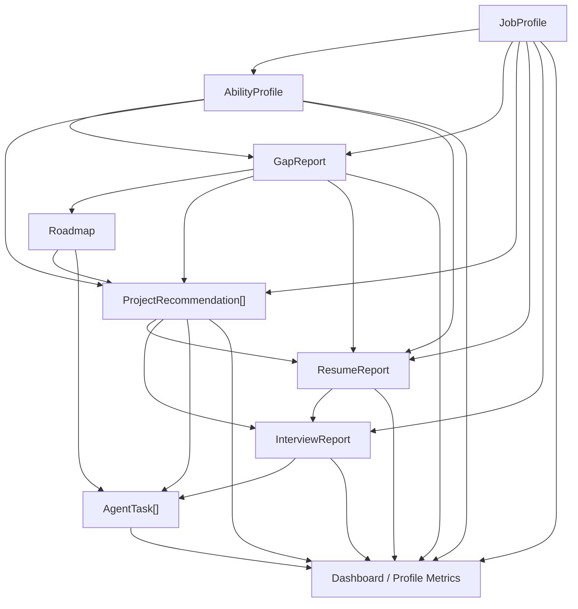

# Agent Workflow

职途 Agent 将求职准备拆分为连续的结构化节点。每个节点读取用户输入和前序结果，输出后续节点可以继续使用的数据，最终形成“分析—规划—执行—反馈”的闭环。

## 完整工作流

```mermaid
flowchart LR
  A["目标岗位 / 上传 JD<br/>输入：岗位、公司、JD<br/>页面：/、/upload"]
  B["JobProfile 岗位画像<br/>输出：职责、技能、工具、关键词<br/>页面：/analysis、/analysis-jd"]
  C["AbilityProfile 能力画像<br/>输入：个人经历 + JobProfile<br/>页面：/assessment"]
  D["GapReport 差距诊断<br/>输入：JobProfile + AbilityProfile<br/>页面：/gap"]
  E["Roadmap 学习路线<br/>输入：GapReport + JobProfile<br/>页面：/roadmap"]
  F["ProjectRecommendation 项目推荐<br/>输入：岗位、能力、Gap、Roadmap<br/>页面：/projects"]
  G["ResumeReport 简历优化<br/>输入：岗位、能力、Gap、Projects<br/>页面：/resume"]
  H["InterviewReport 模拟面试<br/>输入：岗位、项目、简历<br/>页面：/interview"]
  I["Tasks 执行中心<br/>输入：路线、项目交付物、面试建议<br/>页面：/tasks"]
  J["Dashboard / Profile 反馈<br/>输出：进度、指标、下一步动作<br/>页面：/、/profile"]

  A --> B --> C --> D --> E --> F --> G --> H --> I --> J
  J -.任务状态与新输入更新.-> C
```

## 节点说明

| 阶段 | 对应页面 | 主要输入 | 主要输出 | 实现方式 | 用户价值 |
| --- | --- | --- | --- | --- | --- |
| 目标岗位与 JD | `/`、`/upload` | 岗位、公司、PDF JD | 目标信息、JD 全文 | 用户输入 + PDF.js | 使用真实岗位要求作为后续分析依据 |
| 岗位画像 | `/analysis`、`/analysis-jd` | 岗位、公司、JD | `JobProfile` | LLM | 把复杂 JD 转换为职责、技能和评估标准 |
| 能力画像 | `/assessment` | 教育、经历、技能、优势、弱项、岗位画像 | `AbilityProfile` | LLM | 形成面向目标岗位的个人能力描述 |
| 差距诊断 | `/gap` | `JobProfile`、`AbilityProfile` | `GapReport` | 本地规则 | 找出已匹配技能、缺失技能和优先补齐项 |
| 学习路线 | `/roadmap` | `GapReport`、`JobProfile` | `Roadmap` | 本地规则 | 把差距拆解为阶段目标、任务和验收标准 |
| 项目推荐 | `/projects` | 岗位、能力、Gap、Roadmap | `ProjectRecommendation[]` | LLM + fallback | 用可交付项目证明关键能力 |
| 简历优化 | `/resume` | 岗位、能力、Gap、推荐项目 | `ResumeReport` | LLM + fallback | 将能力和项目转换为岗位相关简历表达 |
| 模拟面试 | `/interview` | 岗位、项目、简历报告、用户回答 | `InterviewReport` | LLM + fallback | 进行针对性提问、评分和回答优化 |
| 执行中心 | `/tasks` | Roadmap、项目交付物、面试练习建议 | `AgentTask[]` | 本地规则 | 把报告中的建议转换为可跟踪任务 |
| 进度反馈 | `/`、`/profile` | 完整 `AgentState`、任务状态 | 完成度、分数、任务统计、下一步 | 本地规则 | 让用户知道当前进度和接下来要做什么 |

## 数据如何贯穿工作流

这种设计的重点不是增加更多 AI 对话，而是让前序结构化结果成为后序节点的可靠输入，减少重复填写并保持求职目标一致。

## AI 节点与规则节点

### AI 节点

- JobProfile
- AbilityProfile
- ProjectRecommendation
- ResumeReport
- InterviewReport
- 面试回答评分

这些节点需要处理非结构化输入、生成解释性内容或提供个性化表达，因此使用 LLM。

### 规则节点

- GapReport
- Roadmap
- Tasks
- Dashboard / Profile 指标

这些节点更适合确定性计算，使用本地规则可以让结果更稳定、可测试，也便于在模型不可用时保留部分主链路。

## 反馈闭环

Tasks 不是工作流的终点。任务状态变化后：

1. Dashboard 更新任务总数、已完成数、待完成数和完成率。
2. Profile 更新成长档案中的执行数据。
3. Dashboard 根据缺失的阶段结果或未完成任务推荐下一步动作。
4. 用户补充新经历或切换岗位后，可以重新生成后续报告。

当前反馈来自 `AgentState` 与本地任务状态，不是模型自动观察用户真实学习行为。

## 当前边界

- 工作流状态保存在 `localStorage`
- 没有用户账号、数据库或多设备同步
- 部分 AI 节点有 fallback，但并非所有节点都能离线运行
- Dashboard 和 Profile 展示的是项目内状态派生结果，不是外部招聘平台数据
- 项目是 MVP / prototype，用于验证工作流，不代表完整职业服务能力
