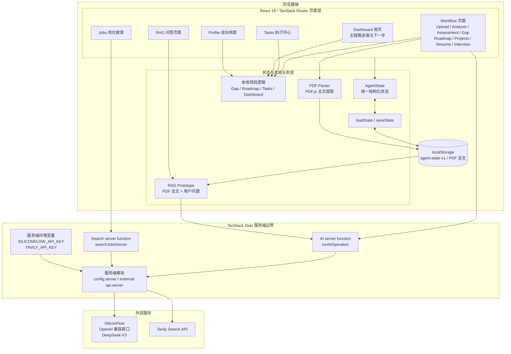
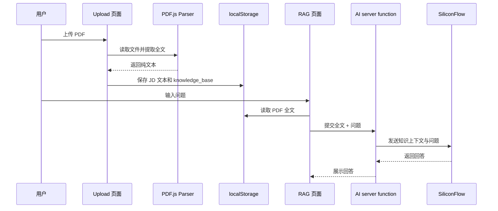
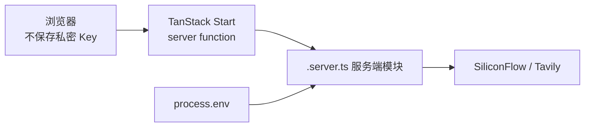

# 项目架构

本文档说明职途 Agent MVP 的页面、状态、业务逻辑、服务端调用、外部服务和 PDF 全文知识库问答原型之间的关系。

## 总体架构

## 分层说明

### 页面层

页面由 React 与 TanStack Router 组织，主要分为：

- 主 Workflow 页面：岗位输入、JD 上传、岗位分析、能力评估、Gap、Roadmap、Projects、Resume、Interview
- `Tasks`：汇总学习、项目与面试任务并管理状态
- `Dashboard`：展示主链路完成度、匹配度、任务进度和下一步动作
- `Profile`：展示当前技能、项目和成长数据
- `Jobs`：通过 Tavily 搜索岗位相关公开信息
- `RAG`：针对已上传 PDF 全文进行问答

### 状态层

`AgentState` 是当前业务数据的统一结构，包含：

- 目标岗位与目标公司
- 用户教育、经历、技能、优势和弱项
- JD 文本与文件名
- 各阶段结构化报告
- 执行任务及其状态

页面通过 `loadState` 和 `saveState` 读写 `localStorage` 中的 `agent-state-v1`。当前没有服务端数据库，也没有用户级数据隔离。

### 本地规则层

以下能力不依赖 LLM 直接生成：

- 根据岗位画像和能力画像生成 Gap
- 根据 Gap 和岗位画像生成 90 天 Roadmap
- 从 Roadmap、项目交付物和面试建议生成 Tasks
- 保留任务状态并计算完成率
- 从 `AgentState` 派生 Dashboard / Profile 指标和下一步动作

规则逻辑使部分关键结果可预测，也减少了所有节点都依赖外部模型的风险。

### AI server functions

浏览器不直接访问 SiliconFlow。页面调用 `runAiOperation` server function，并通过操作类型区分：

- 岗位画像
- 能力画像
- 项目推荐
- 简历报告
- 面试题
- 面试回答评分
- 知识库问答

server function 构建 Prompt 后，由服务端模块读取环境变量并调用 SiliconFlow。

岗位搜索同样通过独立的 `searchJobsServer` server function 调用 Tavily。

### 外部服务

- SiliconFlow：通过 OpenAI 兼容接口调用 `deepseek-ai/DeepSeek-V3`
- Tavily：提供基础岗位搜索结果

外部服务不可用时，项目推荐、简历报告和面试相关能力具有部分本地 fallback。岗位画像与能力画像仍需要有效的 AI 请求。

## PDF 与 RAG Prototype

当前实现是 PDF 全文知识库问答原型：

- 没有文档分块
- 没有 Embedding
- 没有向量数据库
- 没有语义召回和重排序
- 没有引用页码或来源溯源

因此它不是完整的向量数据库 RAG，只适用于 MVP 阶段的小规模全文问答验证。

## 安全边界

当前安全整改包括：

- 私密 Key 不使用 `VITE_` 前缀
- Key 由服务端 `process.env` 读取
- 外部 API 调用集中在服务端模块
- `.env` 被 Git 忽略
- 客户端只接收业务结果

该架构仍未覆盖身份认证、授权、限流、审计、密钥轮换、文件大小限制和生产级内容安全。

## 当前架构边界

- 项目是本地运行的 MVP / prototype
- 唯一持久化存储是当前浏览器的 `localStorage`
- 没有登录系统
- 没有真实数据库
- 没有云端备份或多设备同步
- 清理浏览器数据会导致本地数据丢失
- server function 保护 API Key，但不等同于完整生产安全体系
